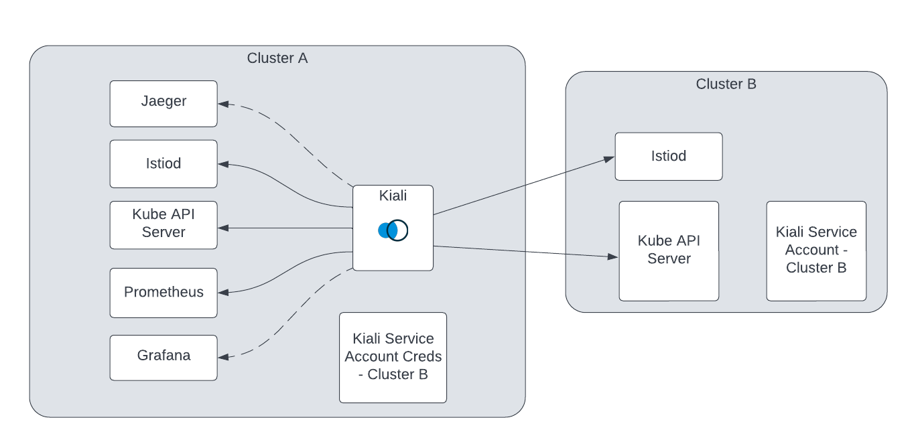
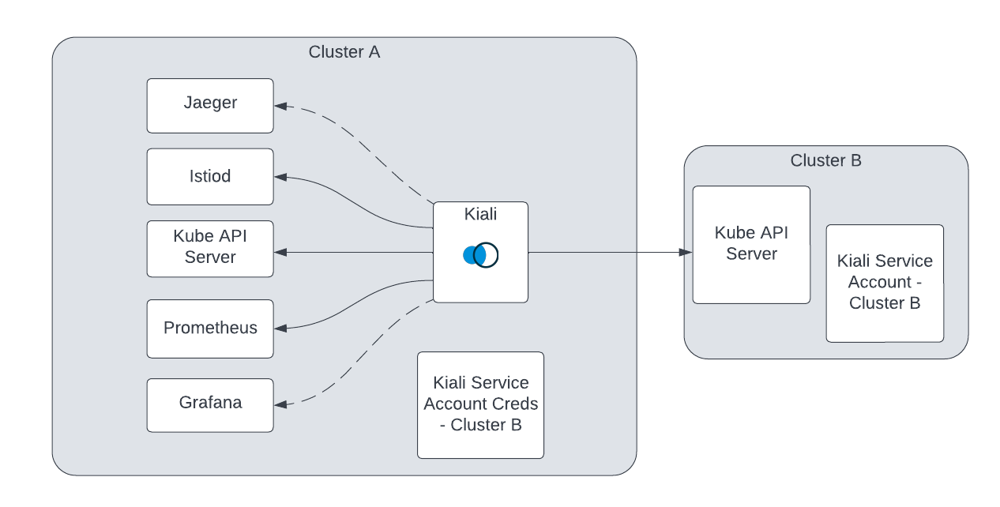

# Multicluster support

1. [Summary](#summary)
2. [Motivation](#motivation)
   1. [Goals](#goals)
   2. [Non-Goals](#nongoals)
3. [Solution](#solution)
   1. [Other solutions](#othersolutions)
4. [Roadmap](#roadmap)

# Summary

Multi-cluster support for Kiali. A “single pane of glass” for your istio service mesh.

[github discussions](https://github.com/kiali/kiali/discussions/categories/multicluster)

# Motivation

It is now common for meshes to span across multiple clusters and yet Kiali only partially supports multi-cluster deployments today. Users should be able to visualize their workloads on the graph across clusters, dig into details via the workload/app/service pages, receive validations for their istio config etc. across their whole mesh from a single Kiali.

## Goals

- Multi-cluster mesh support - single pane of glass for your entire mesh.
- Support multi-primary and primary-remote Istio deployment models.
- Support RBAC authentication strategy for multi-cluster deployments.

## Non-goals

- Custom aggregation of all Kiali’s datasources across clusters. There are other tools and initiatives for aggregating metrics/logs/traces such as otel and this does not need to be handled by Kiali.
- Ambient is not going to be touched in this effort.
- Multi-mesh support - multi-cluster is focused on single mesh support only but shouldn’t prevent Kiali from supporting multi-mesh in the future.

# Solution

A single Kiali configured to access each Kubernetes cluster that is part of the mesh. Kiali will require Metrics/traces to be aggregated in a centralized datastore that Kiali can query.

In a multicluster deployment, Kiali will only support the OIDC auth strategy for now.

## Deployment models

In each of the deployment models, these are the requirements for a centralized Kiali

1. Access to each kube API server that is part of the mesh
2. Istiod access\*
3. Aggregated metrics/traces
4. OIDC auth strategy

Regarding istiod access, if the istiod pods are running within the kube clusters that are part of the multi-cluster mesh, Kiali will access these by portforwarding using the kube API. Kiali won't support controlplanes that are completely external to the mesh but if the istiod requirement becomes optional in a future version of Kiali then Kiali could support external controlplanes as well.

A service account in each cluster will provide Kiali with access to that cluster's kube API. Credentials for that service account will be stored in a secret and used by the Kiali pod to communicate with the external Kube apis.

Note that a single or different network topology won't affect Kiali's configuration and deployment since Kiali will only need access to the Kubernetes API.

### Multi Primary deployment



### Primary-Remote deployment



## Aggregated metrics and traces

Kiali will require metrics/traces to be aggregated into a centralized datastore rather than aggregating this information itself. It is the user’s responsibility to ensure that metrics/traces are centralized by some means. Metrics and traces will need to include a cluster identifier as an attribute/label on each metric so that Kiali can distinguish between workloads/services running on separate clusters. [Istio standard metrics](https://istio.io/latest/docs/reference/config/metrics/#labels) includes `destination_cluster` and `source_cluster`. Kiali already uses these values for cluster boxing. Traces do no include a cluster identifier but one can be added by creating a telemetry api object. Example:

```
apiVersion: telemetry.istio.io/v1alpha1
kind: Telemetry
metadata:
  name: mesh-default
  namespace: istio-system
spec:
  tracing:
  - customTags:
      cluster:
        literal:
          value: Kubernetes
```

[query_scope](https://kiali.io/docs/configuration/kialis.kiali.io/#.spec.external_services.prometheus.query_scope) can be used to limit what Kiali sees from the prometheus and jaeger queries to include only workloads/services within the mesh if these datastores are shared with non-mesh workloads.

## Authentication schemes

In single-cluster, Kiali currently supports the following [authentication schemes](https://kiali.io/docs/configuration/authentication/):

- Anonymous
- Header
- OpenID Connect (OIDC)
- OpenShift
- Token

of these only OpenID Connect and Header currently provide the ability to perform cross cluster authentication. The Token scheme is tied to a single cluster since it uses service account tokens tied to service accounts in a single cluster. The openshift strategy does not support multiple clusters.

The security model Kiali has today assumes a namespace boundary scoped to a single cluster. Of the different authentication options that Kiali supports, RBAC would work cross cluster if RBAC was managed by an external provider that spanned across the clusters. This requires an admin to properly setup the OIDC provider across clusters.

The namespace service is used to determine if a user has access to resources in that namespace: https://github.com/kiali/kiali/blob/master/business/namespaces.go#L64. For multi-cluster, Kiali will check the user's permissions for that namespace across all clusters. As an optimization, the namespace service can accept a list of specific clusters to query against.

## API

Kiali’s current model of a Service/Workload/App (s/w/a) uses a namespace/name to uniquely identify any particular s/w/a e.g. a “reviews” service in namespace “bookinfo” is uniquely identified as “reviews/bookinfo”. This model works fine for a single cluster deployment but does not uniquely identify a service in multi-cluster. Services and workloads can span multiple clusters.

With some exceptions, Istio sees two services with the same FQDN across two different clusters as the same service and will load balance traffic between the two. You can see this when verifying your [multi-cluster traffic](https://istio.io/latest/docs/setup/install/multicluster/verify/#verifying-cross-cluster-traffic) with requests being load balanced across services located in both clusters. Therefore in a multi-cluster deployment, Kiali should no longer treat namespace/name as unique and consider services and workloads with the same namespace/name _across_ clusters as the same service or workload. This is adheres to [namespace sameness](https://github.com/kubernetes/community/blob/master/sig-multicluster/namespace-sameness-position-statement.md).

Exceptions to this are:

1. [Cluster local services](https://istio.io/latest/docs/ops/configuration/traffic-management/multicluster/#keeping-traffic-in-cluster) configured either locally or globally for a particular service.
2. [Workloads partitioned](https://istio.io/latest/docs/ops/configuration/traffic-management/multicluster/#partitioning-services) by destination rule / Virtual service.

The API routes to a particular s/w/a based on the namespace/name e.g. `/api/namespaces/{namespace}/workloads/{workload}`. These namespace specific routes will stay the same but they will include results from all clusters. e.g. given a `bookinfo/reivews` service in cluster A and cluster B, `/api/namespaces/bookinfo/services/reviews` would return info about a reviews service from both cluster A and B.

It will be up to the business layer to aggregate all of the info across clusters. Fetching workloads and services will need to be done inside the business layer for every cluster Kiali is connected to. Since details of workloads/services can vary based on the cluster, e.g. the `reviews.bookinfo` Service in cluster A may have different labels than on cluster B and Kiali needs to show those details, the Kiali details models will need to distinguish between the `Service` objects on cluster A vs. cluster B. Istio config will also need a way to uniquely identify istio config across clusters. Istio configuration is not shared across clusters and is specific to the cluster it resides in.

Some services/workloads may span across clusters but some may not. Business layer services can optionally accept a list of specific clusters to query against for a given s/w/a as an optimization. The business services will need to handle this aggregation properly and cannot assume that s/w/a will exist in all clusters or only in a single cluster.

## UI/UX

This proposal focuses mostly on the backend changes necessary to enable a multi-cluster deployment of Kiali however some UI elements can and should change with a multi-cluster deployment. Exact details of UI changes will be left to future issues.

## Configuration

To deploy a multi-cluster Kiali, users are expected to configure Kiali with access to:

- Centralized prometheus
- Centralized Jaeger
- 1..N Kube API servers where N is the number of kube clusters in the mesh. Kiali will require kube api credentials to communicate with each of these kube api servers.

Access to the Kube API servers can be granted by:

1. Creating a service account in the target cluster.
2. Granting proper permissions for this service account.
3. Creating a secret with the credentials for this service account in the cluster/namespace where Kiali is deployed.

This process will need to be repeated for every new cluster added. Adding or removing clusters will also require restarting the Kiali pod in order for the cache watches to pick up the new kube config. Adding/removing kube clusters without having to restart Kiali can be an improvement made later.

## Operator

The Kiali operator will still be used for configuring Kiali itself however, it's assumed that the operator won't have access to other kube clusters other than where Kiali is deployed and therefore configuring multicluster access for Kiali will be a manual operation. The operator will remain unchanged in a multi-cluster deployment.

## Testing

All automated e2e testing, API and cypress, is currently performed against a single cluster in CI. There will be a large number of Kiali features related to multi-cluster so there needs to be a way to test multi-cluster deployments frequently and in an automated fashion. Any e2e tests that require a multi-cluster environment will need to be run separately from the rest of the suite.

## Other solutions

### Kiali Agent

A process that runs on each kube cluster that is a part of the mesh and exports Kiali’s view of that mesh to a centralized Kiali. This option offers potential performance gains and ease of configuration since Kiali no longer has to communicate with each individual kube cluster. However, it complicates Kiali’s ability to perform authorization with RBAC since the agents would be exporting data to a centralized Kiali and the centralized Kiali would not have access to the individual clusters. The agent itself adds an additional component to Kiali that would need to be maintained and configured across clusters.

### Connecting directly to istiod

The istiods provide istio config and some information about the mesh workloads. However, the endpoints are not always exposed outside of the istiod pod. Kiali today uses port forwarding through the kubernetes API to connect to the istiod pods and this would require access to the kube API anyways. Some other features rely on the kube API like streaming logs and any create/update operations need to use the Kube API ultimately making this an un-viable option to keep most of the existing Kiali features.

# Roadmap

- [ ] Multicluster Kubernetes support for Kiali.
  - [ ] Cache can be configured for multiple kubernetes clusters.
  - [ ] Client can be configured for multiple kubernetes clusters.
- [ ] Business services query across configured clusters for resources.
- [ ] Investigate automated testing setup: how kiali should test multi-cluster features in CI/CD.
- [ ] Multi-cluster demos for the different deployment models. These can also be used for testing.
